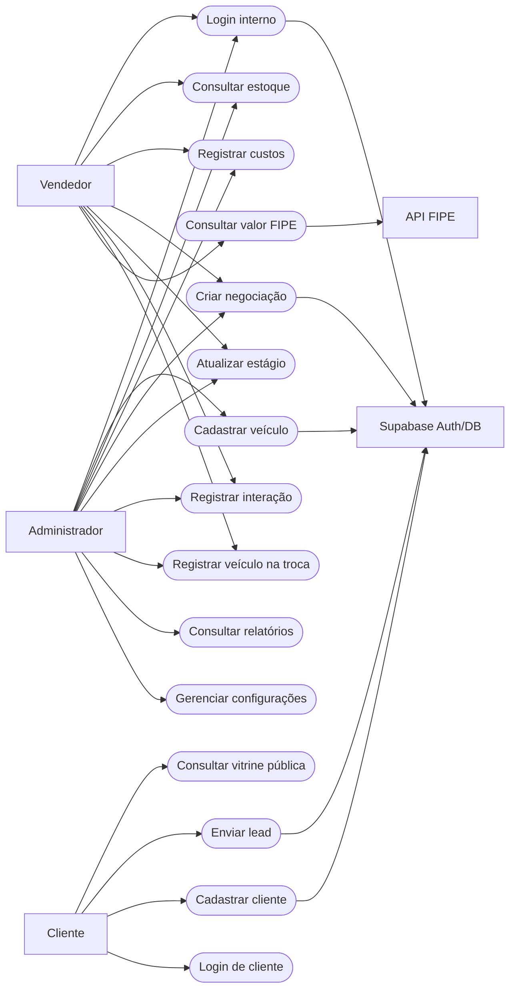
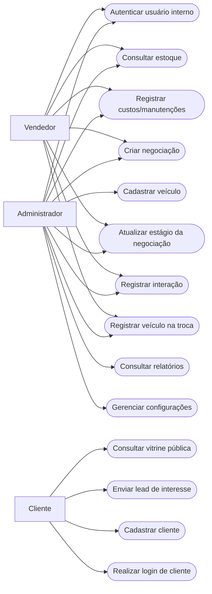
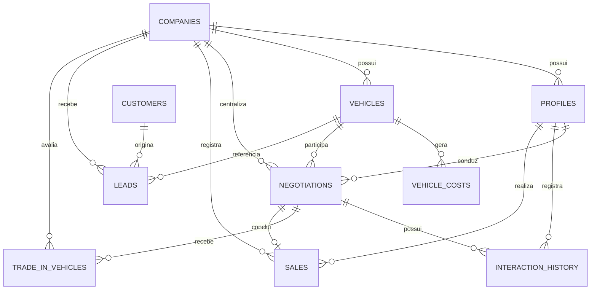
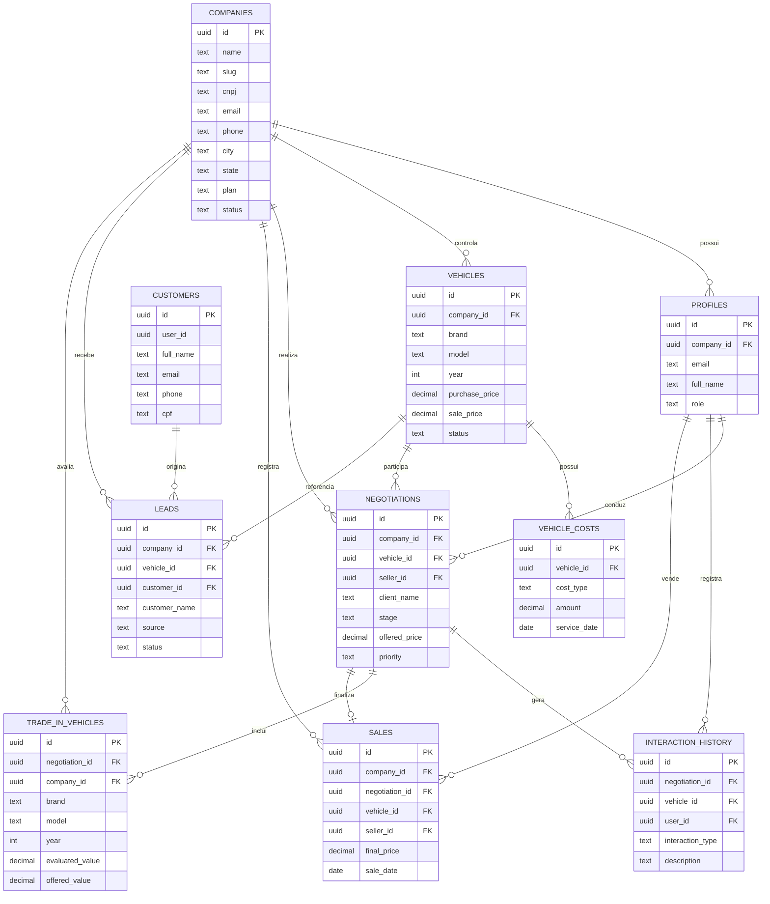
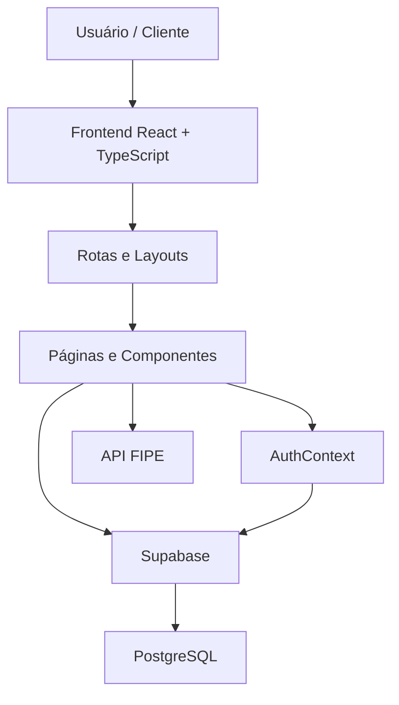

# 3.4 Casos de uso



## Visão geral
O projeto **LuxCar / AutoGest** é um sistema web para gerenciamento de concessionárias e lojas de veículos. A aplicação atende dois públicos principais: equipe interna da loja e clientes externos. Internamente, o sistema permite controlar estoque, custos, negociações, vendas e indicadores. Externamente, o cliente pode consultar veículos disponíveis, criar conta e demonstrar interesse em um automóvel.

## Atores do sistema
- **Administrador**: gerencia cadastros, veículos, usuários, relatórios e configurações da empresa.
- **Vendedor**: acompanha negociações, registra interações, consulta estoque e alimenta o funil comercial.
- **Cliente**: consulta veículos, realiza cadastro/login e envia interesse em um veículo.
- **Supabase**: serviço responsável por autenticação, banco de dados e políticas de segurança.
- **API FIPE**: serviço externo usado para consulta de valores de referência de mercado.

## Principais casos de uso

### UC01 - Autenticar usuário interno
- **Ator principal**: Administrador ou Vendedor
- **Objetivo**: acessar a área administrativa do sistema
- **Pré-condição**: possuir conta cadastrada
- **Fluxo principal**:
  1. O usuário acessa a tela de login.
  2. Informa e-mail e senha.
  3. O sistema valida as credenciais no Supabase Auth.
  4. O sistema carrega o perfil do usuário.
  5. O usuário é redirecionado ao dashboard.
- **Pós-condição**: sessão autenticada e perfil carregado.

### UC02 - Cadastrar veículo
- **Ator principal**: Administrador
- **Objetivo**: inserir um novo veículo no estoque
- **Pré-condição**: estar autenticado como administrador
- **Fluxo principal**:
  1. O administrador acessa a tela de veículos.
  2. Aciona a opção "Novo Veículo".
  3. Preenche dados técnicos, valores, imagens e descrição.
  4. Opcionalmente consulta a FIPE.
  5. O sistema grava o veículo no banco.
- **Pós-condição**: veículo disponível no estoque.

### UC03 - Consultar e filtrar estoque
- **Ator principal**: Administrador ou Vendedor
- **Objetivo**: localizar veículos por status, marca, modelo ou ano
- **Fluxo principal**:
  1. O usuário acessa a lista de veículos.
  2. Informa termos de busca e/ou filtros.
  3. O sistema exibe apenas os veículos compatíveis.
- **Pós-condição**: estoque filtrado conforme a necessidade operacional.

### UC04 - Registrar custos e manutenções
- **Ator principal**: Administrador ou Vendedor
- **Objetivo**: registrar despesas relacionadas ao veículo
- **Pré-condição**: veículo já cadastrado
- **Fluxo principal**:
  1. O usuário acessa os detalhes do veículo.
  2. Adiciona um custo ou manutenção.
  3. Informa tipo, descrição, valor e data.
  4. O sistema recalcula o investimento total e o lucro estimado.
- **Pós-condição**: custo armazenado e indicadores atualizados.

### UC05 - Iniciar negociação
- **Ator principal**: Vendedor
- **Objetivo**: criar uma negociação de venda para um veículo
- **Pré-condição**: veículo cadastrado
- **Fluxo principal**:
  1. O vendedor acessa o módulo de negociações.
  2. Seleciona "Nova Negociação".
  3. Associa um veículo e informa dados do cliente.
  4. Define estágio inicial e prioridade.
  5. O sistema grava a negociação.
- **Pós-condição**: negociação aberta e vinculada ao veículo.

### UC06 - Atualizar estágio da negociação
- **Ator principal**: Vendedor
- **Objetivo**: avançar ou encerrar o atendimento comercial
- **Fluxo principal**:
  1. O vendedor abre os detalhes da negociação.
  2. Seleciona um novo estágio.
  3. O sistema salva a atualização.
  4. Se o estágio for "finalizado", o sistema marca o veículo como vendido e cria uma venda.
  5. Se o estágio for "perdido", o sistema devolve o veículo para disponível.
- **Pós-condição**: funil comercial e status do veículo sincronizados.

### UC07 - Registrar interação com cliente
- **Ator principal**: Vendedor
- **Objetivo**: manter histórico do relacionamento comercial
- **Pré-condição**: negociação existente
- **Fluxo principal**:
  1. O vendedor acessa a negociação.
  2. Adiciona uma interação.
  3. Informa tipo de contato e descrição.
  4. O sistema registra data, hora e usuário responsável.
- **Pós-condição**: histórico atualizado.

### UC08 - Registrar veículo na troca
- **Ator principal**: Vendedor
- **Objetivo**: cadastrar veículo usado oferecido pelo cliente na negociação
- **Pré-condição**: negociação existente
- **Fluxo principal**:
  1. O vendedor acessa a negociação.
  2. Adiciona um veículo de troca.
  3. Informa dados do usado, avaliação, fotos e observações.
  4. O sistema salva o item vinculado à negociação.
- **Pós-condição**: veículo de troca registrado para análise.

### UC09 - Consultar relatórios
- **Ator principal**: Administrador
- **Objetivo**: acompanhar desempenho comercial e financeiro
- **Fluxo principal**:
  1. O administrador acessa a tela de relatórios.
  2. Define o período desejado.
  3. O sistema calcula indicadores, vendas por mês, por vendedor e por veículo.
- **Pós-condição**: relatórios exibidos para apoio à decisão.

### UC10 - Consultar vitrine pública
- **Ator principal**: Cliente
- **Objetivo**: visualizar veículos disponíveis
- **Fluxo principal**:
  1. O cliente acessa a página inicial pública.
  2. Pesquisa por marca, modelo, faixa de preço e outros filtros.
  3. O sistema lista os veículos disponíveis.
  4. O cliente acessa os detalhes de um veículo.
- **Pós-condição**: veículo localizado para possível contato.

### UC11 - Demonstrar interesse em veículo
- **Ator principal**: Cliente
- **Objetivo**: enviar um lead para a loja
- **Pré-condição**: veículo público disponível
- **Fluxo principal**:
  1. O cliente abre os detalhes do veículo.
  2. Preenche o formulário de interesse.
  3. O sistema grava o lead com origem "website".
- **Pós-condição**: lead disponível para atendimento da loja.

### UC12 - Cadastrar cliente externo
- **Ator principal**: Cliente
- **Objetivo**: criar conta no sistema público
- **Fluxo principal**:
  1. O cliente acessa a tela de cadastro.
  2. Informa nome, e-mail, telefone e senha.
  3. O sistema cria o usuário no Supabase Auth.
  4. O sistema cria o registro correspondente em `customers`.
- **Pós-condição**: conta de cliente criada.

# 3.5 Diagrama de caso de uso



# 3.6 Diagramas de Classes

## Classes de domínio
As classes abaixo representam os principais objetos de negócio identificados a partir dos tipos TypeScript e das tabelas utilizadas pelo sistema.

```mermaid
classDiagram
    class Company {
      +UUID id
      +string name
      +string slug
      +string cnpj
      +string email
      +string phone
      +string city
      +string state
      +string plan
      +string status
    }

    class Profile {
      +UUID id
      +string email
      +string full_name
      +string role
      +UUID company_id
    }

    class Customer {
      +UUID id
      +UUID user_id
      +string full_name
      +string email
      +string phone
      +string cpf
    }

    class Vehicle {
      +UUID id
      +UUID company_id
      +string brand
      +string model
      +int year
      +string version
      +decimal purchase_price
      +decimal sale_price
      +decimal fipe_value
      +string status
      +string plate
      +int mileage
      +string fuel_type
      +string transmission
      +string[] images
    }

    class VehicleCost {
      +UUID id
      +UUID vehicle_id
      +string cost_type
      +string description
      +decimal amount
      +date service_date
    }

    class Negotiation {
      +UUID id
      +UUID vehicle_id
      +UUID seller_id
      +UUID company_id
      +string client_name
      +string client_phone
      +string client_email
      +string client_cpf
      +string stage
      +decimal offered_price
      +string priority
    }

    class InteractionHistory {
      +UUID id
      +UUID negotiation_id
      +UUID vehicle_id
      +UUID user_id
      +string interaction_type
      +string description
      +datetime created_at
    }

    class Sale {
      +UUID id
      +UUID negotiation_id
      +UUID vehicle_id
      +UUID seller_id
      +UUID company_id
      +decimal final_price
      +date sale_date
    }

    class Lead {
      +UUID id
      +UUID company_id
      +UUID vehicle_id
      +UUID customer_id
      +string customer_name
      +string customer_email
      +string customer_phone
      +string source
      +string status
    }

    class TradeInVehicle {
      +UUID id
      +UUID negotiation_id
      +UUID company_id
      +string brand
      +string model
      +int year
      +decimal evaluated_value
      +decimal offered_value
      +bool needs_evaluation
    }

    Company "1" --> "*" Profile
    Company "1" --> "*" Vehicle
    Company "1" --> "*" Negotiation
    Company "1" --> "*" Sale
    Company "1" --> "*" Lead
    Company "1" --> "*" TradeInVehicle
    Vehicle "1" --> "*" VehicleCost
    Vehicle "1" --> "*" Negotiation
    Vehicle "1" --> "*" Lead
    Negotiation "1" --> "*" InteractionHistory
    Negotiation "1" --> "*" TradeInVehicle
    Negotiation "1" --> "0..1" Sale
    Profile "1" --> "*" Negotiation
    Profile "1" --> "*" InteractionHistory
    Profile "1" --> "*" Sale
    Customer "1" --> "*" Lead
```



## Interpretação do diagrama
- `Company` representa a loja no modelo SaaS multiempresa.
- `Profile` representa o usuário interno autenticado, com papel de administrador ou vendedor.
- `Vehicle` é a entidade central do estoque.
- `VehicleCost` guarda despesas e manutenções ligadas ao veículo.
- `Negotiation` controla o funil comercial entre loja e cliente.
- `InteractionHistory` registra o histórico do atendimento.
- `Sale` representa a conclusão financeira da negociação.
- `Lead` captura oportunidades vindas do site público.
- `TradeInVehicle` armazena dados do veículo usado oferecido pelo cliente.

# 3.8 Protótipo da aplicação (Wireframe)

## Wireframe da área pública

```text
+----------------------------------------------------------------------------------+
| LOGO LuxCar                           [Sou Lojista] [Sou Cliente]               |
+----------------------------------------------------------------------------------+
| [ Buscar por marca ou modelo.............................................. ]    |
| [Filtros]                                                                      |
+----------------------------------------------------------------------------------+
| Marca | Ano Min | Ano Max | Combustível | Preço Min | Preço Max | Câmbio       |
+----------------------------------------------------------------------------------+
| Veículo 1                  | Veículo 2                  | Veículo 3             |
| [ Foto ]                   | [ Foto ]                   | [ Foto ]              |
| Marca Modelo               | Marca Modelo               | Marca Modelo          |
| Ano | KM                   | Ano | KM                   | Ano | KM              |
| Preço                       | Preço                      | Preço                 |
| Loja / Cidade               | Loja / Cidade              | Loja / Cidade         |
+----------------------------------------------------------------------------------+
```

## Wireframe do dashboard interno

```text
+----------------------------------------------------------------------------------+
| Menu lateral         | Dashboard                                                 |
| - Dashboard          | Bem-vindo, usuário                                        |
| - Veículos           +-----------------------------------------------------------+
| - Negociações        | Card 1 | Card 2 | Card 3 | Card 4                         |
| - Relatórios         +-----------------------------------------------------------+
| - Configurações      | Gráfico status veículos | Lista veículos recentes         |
|                      +-----------------------------------------------------------+
|                      | Tabela de negociações recentes                            |
+----------------------------------------------------------------------------------+
```

## Wireframe da tela de veículos

```text
+----------------------------------------------------------------------------------+
| Título: Veículos                                            [Novo Veículo]      |
+----------------------------------------------------------------------------------+
| [Buscar marca/modelo/ano.............................] [Filtro por status]      |
+----------------------------------------------------------------------------------+
| Card veículo 1        | Card veículo 2        | Card veículo 3                  |
| [Imagem]              | [Imagem]              | [Imagem]                        |
| Marca Modelo          | Marca Modelo          | Marca Modelo                    |
| Ano / Versão          | Ano / Versão          | Ano / Versão                    |
| Status                | Status                | Status                          |
| Compra / Venda        | Compra / Venda        | Compra / Venda                  |
| [Detalhes] [Editar]   | [Detalhes] [Editar]   | [Detalhes] [Editar] [Excluir]  |
+----------------------------------------------------------------------------------+
```

## Wireframe da tela de negociação

```text
+----------------------------------------------------------------------------------+
| Cliente / Veículo                                             [Status Atual]     |
+----------------------------------------------------------------------------------+
| Dados do cliente                    | Atualizar estágio / prioridade             |
| Telefone / Email / CPF / Proposta   | [select estágio] [baixa] [média] [alta]   |
+----------------------------------------------------------------------------------+
| Histórico de interações                                   [Adicionar interação]  |
| - ligação                                                                       |
| - whatsapp                                                                      |
| - proposta                                                                      |
+----------------------------------------------------------------------------------+
| Veículo na troca                                          [Adicionar veículo]    |
| Marca/Modelo | Ano/KM | Avaliado | Ofertado                                     |
+----------------------------------------------------------------------------------+
| Veículo vinculado                     | Vendedor responsável                     |
+----------------------------------------------------------------------------------+
```

# 3.9 Modelagem do banco de dados



## Abordagem adotada
O projeto utiliza o **Supabase**, que por baixo opera sobre **PostgreSQL**. A modelagem é relacional e foi construída para suportar:
- autenticação e autorização;
- controle de múltiplas empresas;
- gestão de estoque de veículos;
- acompanhamento de negociações e vendas;
- captação de leads no site público;
- histórico de custos, interações e veículos recebidos na troca.

## Principais entidades
- `companies`: armazena dados da loja/concessionária.
- `profiles`: guarda os usuários internos do sistema.
- `customers`: representa os clientes externos.
- `vehicles`: registra o estoque da empresa.
- `vehicle_costs`: registra despesas e manutenções por veículo.
- `negotiations`: armazena negociações de venda.
- `interaction_history`: mantém o histórico de contatos durante a negociação.
- `sales`: registra as vendas concluídas.
- `leads`: armazena manifestações de interesse vindas do site.
- `trade_in_vehicles`: armazena veículos usados oferecidos pelo cliente.

## Regras de negócio refletidas no banco
- Um usuário interno pertence a uma empresa.
- Um veículo pertence a uma empresa.
- Um veículo pode ter vários custos e várias negociações.
- Uma negociação pertence a um vendedor e a um veículo.
- Uma negociação pode gerar uma venda.
- Um lead pode estar ligado a um cliente e opcionalmente a um veículo.
- Um veículo na troca pertence a uma negociação.
- O controle de acesso é reforçado por **Row Level Security (RLS)**.

# 3.10 Modelo entidade relacionamento (DER)



# 3.11 Modelo físico

## SGBD
- **Sistema gerenciador**: PostgreSQL, provisionado pelo Supabase
- **Modelo**: relacional
- **Autenticação**: Supabase Auth
- **Segurança**: Row Level Security com políticas por usuário e empresa

## Exemplo resumido do modelo físico

```sql
CREATE TABLE companies (
  id UUID PRIMARY KEY DEFAULT gen_random_uuid(),
  name TEXT NOT NULL,
  slug TEXT UNIQUE NOT NULL,
  cnpj TEXT UNIQUE,
  email TEXT,
  phone TEXT,
  city TEXT,
  state TEXT,
  status TEXT DEFAULT 'active',
  plan TEXT DEFAULT 'basic',
  created_at TIMESTAMPTZ DEFAULT NOW(),
  updated_at TIMESTAMPTZ DEFAULT NOW()
);

CREATE TABLE profiles (
  id UUID PRIMARY KEY REFERENCES auth.users(id) ON DELETE CASCADE,
  company_id UUID REFERENCES companies(id) ON DELETE CASCADE,
  email TEXT UNIQUE NOT NULL,
  full_name TEXT NOT NULL,
  role TEXT NOT NULL CHECK (role IN ('vendedor', 'administrador')),
  created_at TIMESTAMPTZ DEFAULT NOW(),
  updated_at TIMESTAMPTZ DEFAULT NOW()
);

CREATE TABLE vehicles (
  id UUID PRIMARY KEY DEFAULT gen_random_uuid(),
  company_id UUID REFERENCES companies(id) ON DELETE CASCADE,
  brand TEXT NOT NULL,
  model TEXT NOT NULL,
  year INTEGER NOT NULL,
  purchase_price DECIMAL(10,2) NOT NULL,
  sale_price DECIMAL(10,2) NOT NULL,
  status TEXT NOT NULL DEFAULT 'disponivel',
  created_by UUID REFERENCES profiles(id),
  created_at TIMESTAMPTZ DEFAULT NOW(),
  updated_at TIMESTAMPTZ DEFAULT NOW()
);
```

## Índices identificados no projeto
- índice por status de veículo;
- índice por data de criação de veículos;
- índice por veículo, vendedor e estágio em negociações;
- índice por negociação no histórico de interações;
- índice por vendedor e data em vendas;
- índice por empresa em tabelas multi-tenant;
- índice por status em leads.

## Observações técnicas
- O projeto também utiliza **views** como `dashboard_metrics`, `vehicles_with_negotiations` e `public_vehicles`.
- Triggers são usadas para manter `updated_at`.
- Há funções para criação automática de perfil após registro.

# 3.12 Arquitetura da aplicação

## Estilo arquitetural
A aplicação segue uma arquitetura **web em camadas**, com frontend SPA e backend BaaS:
- **Apresentação**: React + TypeScript + Tailwind CSS
- **Navegação**: React Router
- **Serviços de dados/autenticação**: Supabase
- **Persistência**: PostgreSQL
- **Integração externa**: API FIPE

## Diagrama de arquitetura



## Estrutura lógica identificada no código
- `src/app/pages`: páginas de negócio, como Dashboard, Vehicles, Negotiations e Reports.
- `src/app/components`: formulários e componentes reutilizáveis.
- `src/contexts/AuthContext.tsx`: gerenciamento de autenticação e perfil.
- `src/lib/supabase.ts`: cliente Supabase e tipos do domínio.
- `src/hooks/useFipe.ts`: integração com consulta FIPE.
- arquivos SQL: definição do banco, migrações e políticas de segurança.

## Fluxo arquitetural resumido
1. O usuário acessa uma rota.
2. O React Router carrega a página correspondente.
3. A página consulta o `AuthContext` quando precisa de sessão/perfil.
4. A página consome dados do Supabase.
5. O Supabase aplica autenticação, RLS e persiste os dados no PostgreSQL.
6. Em cenários de preço de referência, o frontend consulta a API FIPE.

## Vantagens da arquitetura
- separação clara entre interface, regras de navegação e persistência;
- rapidez de desenvolvimento com Supabase;
- escalabilidade para múltiplas empresas;
- segurança embutida com autenticação e RLS;
- fácil evolução de módulos como leads, troca e relatórios.

# 3.13 Acessibilidade

## Medidas positivas já observadas
- uso de campos de formulário com `label`;
- navegação baseada em componentes semânticos como botões, links, tabelas e inputs;
- mensagens visuais de sucesso e erro para feedback;
- organização responsiva para desktop e mobile;
- contraste razoável em boa parte dos elementos principais.

## Melhorias recomendadas
- adicionar textos alternativos mais descritivos para todas as imagens de veículos;
- garantir foco visível em todos os componentes interativos;
- revisar contraste de badges coloridas em estados e prioridades;
- complementar ícones com texto para evitar dependência apenas visual;
- adicionar mensagens de erro associadas semanticamente aos campos;
- validar navegação completa por teclado em modais e filtros;
- incluir atributos ARIA em componentes mais complexos;
- oferecer máscara e validação acessível para telefone, CPF e placa;
- disponibilizar aviso de carregamento para leitores de tela.

## Conclusão sobre acessibilidade
O sistema já apresenta uma boa base de usabilidade, mas ainda precisa de refinamentos para atender de forma mais robusta a princípios de acessibilidade, especialmente nos pontos de navegação por teclado, feedback semântico, contraste e suporte a tecnologias assistivas.

# Considerações finais
Com base no código analisado, o projeto LuxCar apresenta uma solução coerente para gerenciamento de concessionária em modelo SaaS, cobrindo cadastro de veículos, negociações, leads, relatórios e autenticação. A documentação acima foi construída diretamente a partir da estrutura real do frontend e dos scripts SQL do projeto, o que a torna adequada como base acadêmica para entrega.
